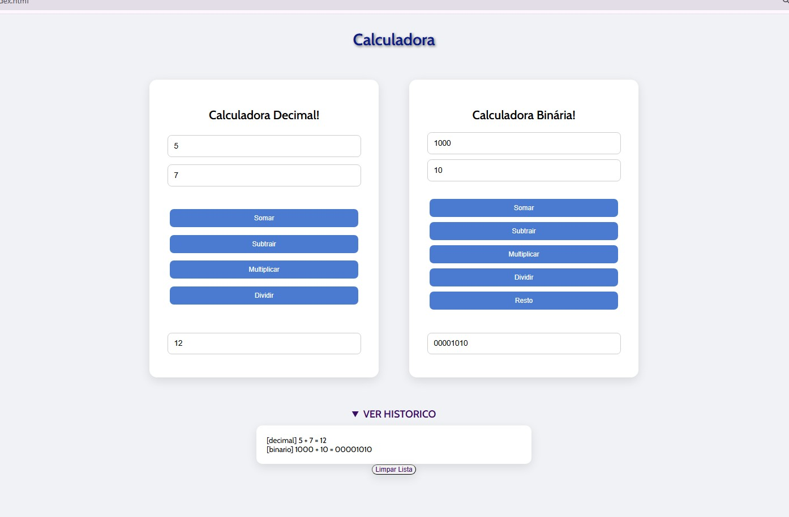

## Acesse o projeto
🔗 https://millena-farias.github.io/Calculadora-Bin-ria-Decimal/

# Calculadora Decimal e Binária

Uma calculadora web que realiza operações matemáticas em decimal e binário, com histórico de cálculos.

## Funcionalidades

- Calculadora decimal: soma, subtração, multiplicação e divisão
- Calculadora binária: soma, subtração, multiplicação, divisão e resto
- Histórico de operações salvo no navegador
- Opção de limpar o histórico

## Tecnologias

- HTML
- CSS
- JavaScript

